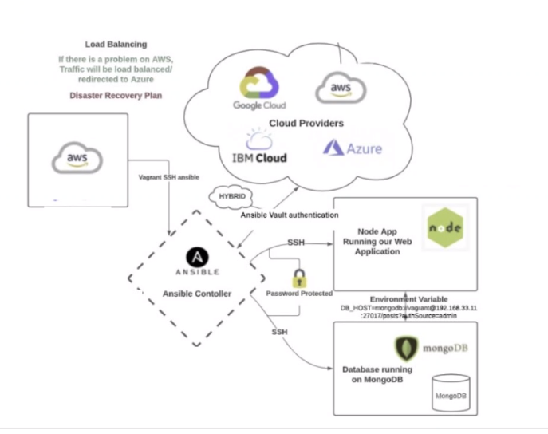

# Ansible

## What is it?

- An open-source IT automation engine.
- Automates provisioning, configuration management, application deployment, orchestration.
- Allows users to define infrastructure and application configurations in code.
- Makes it easier to automate repetitive tasks and manage IT environments efficiently.

Use Ansible automation to install software, automate daily tasks, provision infrastructure, improve security and compliance, patch systems, and share automation across your organization.

## How does it work?

- Ansible connects to your nodes and pushes out small programs - "modules" - to these nodes.
- Modules are used to accomplish automation tasks in Ansible.
- These programs are written to be resource models of the desired state of the system.
- Ansible then executes these modules.
- Removes them when finished.

### Agentless

- The nodes that ansible manages do not requ    ire any software to be installed on them.
- Ansible uses SSH protocl to connect to servers and run tasks.
- Once connected, it transfers the mopdules required by your command or playbook to the remote machine(s) for execution.
- Uses YAML templates so users can program repetitive tasks to happen automatically.

## Diagram:

1. An instance on the cloud.
2. Can SSH into the Ansible controller.
3. These are our instances that Ansible can connect to via SSH. From here it can configure management.
4. Ansible vault is where all keys for each of the instances are kept, meaning that Ansible can connect to any and all cloud providers at the same time.

# Ansible Playbook:

An Ansible Playbook is a blueprint of automation tasks, which are IT actions executed with limited manual effort across an inventory of IT solutions. Playbooks tell Ansible what to do to which devices.

Instead of manually applying the same action to hundreds or thousands of similar technologies across IT environments, executing a playbook automatically completes the same action for the specified type of inventory—such as a set of routers.

Playbooks are used to automate IT infrastructure, without having to do it manually on many machines.