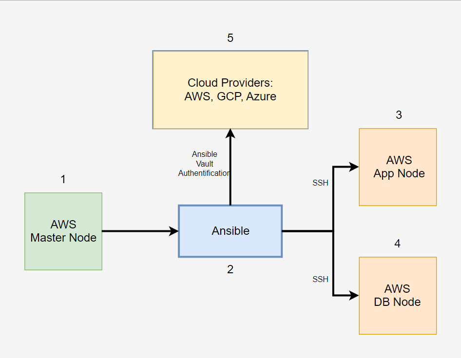

# Ansible

## What is it?

- An open-source IT automation engine.
- Automates provisioning, configuration management, application deployment, orchestration.
- Allows users to define infrastructure and application configurations in code.
- Makes it easier to automate repetitive tasks and manage IT environments efficiently.

Use Ansible automation to install software, automate daily tasks, provision infrastructure, improve security and compliance, patch systems, and share automation across your organization.

## How does it work?

- Ansible connects to your nodes and pushes out small programs - "modules" - to these nodes.
- Modules are used to accomplish automation tasks in Ansible.
- These programs are written to be resource models of the desired state of the system.
- Ansible then executes these modules.
- Removes them when finished.

### Agentless

- The nodes that ansible manages do not require any software to be installed on them.
- Ansible uses SSH protocl to connect to servers and run tasks.
- Once connected, it transfers the mopdules required by your command or playbook to the remote machine(s) for execution.
- Uses YAML templates so users can program repetitive tasks to happen automatically.

## Diagram:

1. A virtual machine instance on the cloud. This is the "Master" or "Controller" node.
2. The Controller node is the installation location of Ansible. From here, the user can set up Ansible, and begin configuring other EC2s..
3. This is another virtual machine. This particular one will be used for app deployment, being know as the "App Node". Ansible can ssh into this node.
4. This is another virtual machine. This particular one will be used for database deployment, being know as the "DB Node". Ansible can ssh into this node.
5. Ansible Vault is a feature in Ansible that allows you to encrypt sensitive data such as passwords, keys, and other secrets within your Ansible playbooks and configuration files. It provides a way to protect this sensitive information and ensure that only authorized users can access it. These are also some various examples of cloud providers Ansible can work with.

