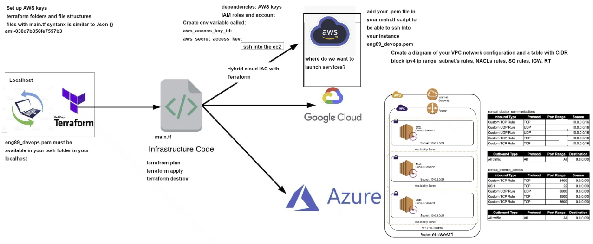

# Terraform

## Orchestration with Terraform:

Orchestration with Terraform refers to the process of using Terraform, an Infrastructure as Code (IaC) tool, to automate the provisioning, configuration, and management of cloud or on-premises infrastructure resources. This includes virtual machines, databases, networks, and other components necessary for running applications.

### What is Terraform:

1. Infrastructure as Code tool.
2. Open Source.
3. Lets you define both cloud and on-prem resources.
4. Human-readable configuration files.
5. You can define your infrastructure using code, and then create / update / delete resources across various cloud providers.

### Who uses it:

1. AWS
2. Cloudflare
3. Microsoft Azure
4. IBM Cloud
5. Oracle

### How does it help businesses:

 1. Manual provisioning is slow and cumbersome
    1. Provisioning infrastructure through point-and-click GUIs or custom scripts is slow, error-prone, inefficient, and doesn't scale.
 2. Automate infrastructure provisioning on any cloud
    1. With Terraform, provisioning and security can be automated with declarative infrastructure and policy as code. Infrastructure and policies are codified, shared, versioned, and executed within a workflow that is consistent across all infrastructure.

### Where can it be used:

Any and all cloud providers.

### Who needs to use it:

DevOps, Cloud, Site Reliability Engineers - anyone who needs to develop, maintain, and deploy infrastructure.

